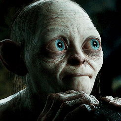
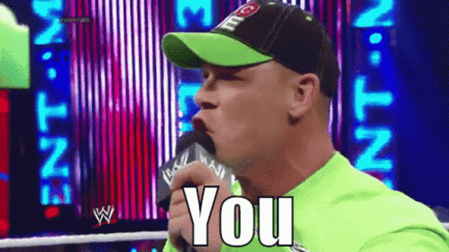
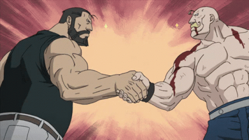
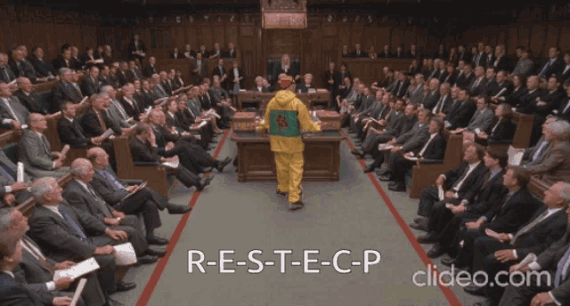
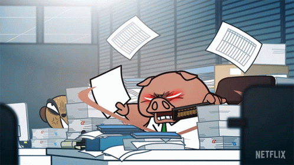

# **Jessy Victor Tibou**
## Back-End Developer

# 1. Qui suis-je?
Salut, je m'appelle Jessy, je suis stagiaire chez Becode et j'y suis une formation pour devenir Back-End Developer.

# 2. Mes Quatres compétences surprenantes.
* Je sais parfaitement imité Gollum/Smeagol.

* J'apprends et pratique l'Indonésien et le Japonais.

* Je suis quelqu'un de fédérateur.

* J'apprends vite.

# 3. Les trois choses que j'aime le plus dans cette univers
* Mon chien. 

* La programmation.

* L'apprentissage des langues (que je détestais étant jeune)

# 4. Mes Objectifs Personnels.
J'aimerais lors de cette formation apprendre un maximum de chose en tant que dev back-end et surtout créer un premier porte folio. 
J'aimerais aussi structuré mes connaissances aprise durant toutes mes jeunes années jusque maintenant pour enfin avoir une base solide.

Si je devais faire une analogie, voici comment je visualise le parcours professionnel d'un dev et mon objectif est de gravir c'est différents pics. cette "métaphore" me prouve qu'un dev apprend tout le temps peu importe son niveau.

# 5. Mes peurs
Mise a part que je sort totalement de ma zone de confort en faisant cette formation. Je pense que ma plus grande crainte est une perte de motivation, heureusement que je suis quelqu'un de plutôt résilient.

# 6. Ce que j'attends avec impatience.

Hormis le DLC Elden Ring Shadow of The ErdTree.

Je dirais que j'attends avec une certaines impatience que l'on apprenne comment ce servir des différents Frameworks de Js et autres.

# 7. Les trois choses que vous apréciez quand vous travaillez en équipe.

La cohésion : La cohésion final est très importante dans une équipe surtout pour avancée rapidement vers l'objectif donné.

Le respect : Le respect est super important en groupe.

la rapidité & précision: La rapidité est essentiel dans notre métier, une équipe rapide , qui fait des erreur et les corriger a la fin, est beaucoups plus utile qu'une équipe lente, qui corrige c'est erreur au fur et à mesure, l'est beaucoup moins.

# 8 Mon Gif Préféré

Comme vous avez pus le voir j'aime les Gifs! Mais mon préféré restera toujours celui ci...

## Merci d'avoir lu !

